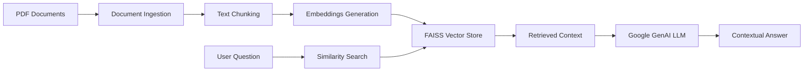

# 🛡️ NIST 800-53 Knowledge Management System

> A private, intelligent chatbot designed to help teams understand and navigate NIST SP 800-53 Rev. 5 security controls and NIST Cybersecurity Framework 2.0.

## 🎯 Purpose

This Knowledge Management System transforms complex NIST documentation into an accessible, conversational interface. Built for cybersecurity professionals, compliance teams, and anyone working with NIST frameworks, it provides instant, contextual answers to your security control questions without sending sensitive data to external services.

**What makes this special:**
- 🔒 **Privacy-first**: Your PDFs stay local—only small retrieved snippets are sent to the LLM
- 🎯 **NIST-focused**: Specialized for SP 800-53r5 security controls and CSF 2.0 framework
- 📚 **Context-aware**: Provides source citations with page numbers for verification
- ⚡ **RAG-powered**: Uses Retrieval-Augmented Generation for accurate, grounded responses

## 🚀 Quick Start

### Prerequisites

- Python 3.9+
- Google AI API key ([Get one here](https://aistudio.google.com/app/apikey))
- NIST PDF documents (SP 800-53 Rev. 5, CSF 2.0, etc.)

### Installation

1. **Clone the repository**
   ```bash
   git clone https://github.com/asfalanoij/NIST_chatbot.git
   cd NIST_chatbot
   ```

2. **Install dependencies**
   ```bash
   pip install -r requirements.txt
   ```

3. **Set up your API key**
   
   Create a `.env` file in the project root:
   ```env
   GOOGLE_API_KEY=your_google_api_key_here
   ```

4. **Add your NIST documents**
   
   Place your PDF files in the `./docs/` directory:
   ```
   docs/
   ├── nist_80053r5.pdf          # NIST SP 800-53 Rev. 5
   ├── NIST_CSF_2.0.pdf          # NIST Cybersecurity Framework 2.0
   ├── fedramp.pdf               # FedRAMP documentation (optional)
   └── incidentresponseforwindows.pdf  # Additional resources (optional)
   ```

5. **Build the knowledge base**
   ```bash
   python ingest.py
   ```
   *This processes your PDFs and creates a searchable FAISS vector index*

6. **Launch the chatbot**
   ```bash
   streamlit run app.py
   ```

Your NIST Knowledge Management System will be available at `http://localhost:8501`

## 💡 How It Works

### The Architecture



### Technology Stack

- **🌐 Frontend**: [Streamlit](https://streamlit.io/) - Clean, interactive web interface
- **🔗 RAG Framework**: [LangChain](https://python.langchain.com/) - Orchestrates the retrieval-augmented generation pipeline
- **🔍 Vector Search**: [FAISS](https://faiss.ai/) - Fast similarity search for finding relevant document chunks
- **📄 PDF Processing**: [PyMuPDF](https://pymupdf.readthedocs.io/) - Extracts text from PDF documents
- **🤖 AI Model**: [Google Generative AI](https://ai.google.dev/) - Powers embeddings and chat completions
- **🔧 Utilities**: python-dotenv for environment management

## 🎭 Usage Examples

### Getting Started Questions

Try these sample queries to explore the system:

**1. Governance & CSF 2.0 Mapping**
```
Map CSF 2.0 Govern outcomes to NIST 800-53r5 control families; give 2–3 exemplar controls per outcome.
```

**2. System-Specific Controls**
```
For a FIPS 199 Moderate system, prioritize AC/IA/SC controls and justify via CSF Protect categories.
```

**3. Implementation Planning**
```
Draft a POA&M template aligning CA/RA controls to CSF Govern/Identify; list minimum evidence fields.
```

**4. Incident Response**
```
Outline an IR playbook linking CSF Respond categories to IR controls (IR-4, IR-5, IR-8).
```

**5. Evidence & Compliance**
```
Build an evidence checklist for CM/CP/AU and show how it supports CSF Detect/Recover.
```

### Understanding the Responses

Each answer includes:
- **Source Citations**: References like `[1]`, `[2]` that link to specific document chunks
- **Page Numbers**: Exact page references for verification
- **Similarity Scores**: Confidence indicators for retrieved content
- **Expandable Context**: Click to see the full text chunks used

## ⚙️ Configuration Options

### Streamlit Interface Controls

- **Top-K Chunks** (2-12): Number of document chunks to retrieve
  - Higher = more context but slower responses
  - Recommended: 6-8 for broad questions, 3-4 for specific ones

- **Temperature** (0.0-1.0): Response creativity/randomness
  - 0.0 = Deterministic, factual
  - 0.2 = Slightly varied (recommended)
  - 1.0 = Most creative but less consistent

- **Minimum Similarity** (0.0-1.0): Quality threshold for retrieved chunks
  - 1.0 = Only very close matches
  - 0.0 = More lenient matching
  - Recommended: 0.0-0.3 for exploratory questions

### Re-indexing Your Documents

After adding or updating PDFs in `./docs/`:
```bash
python ingest.py
```

This rebuilds the FAISS index with your new content.

## 📁 Project Structure

```
NIST_chatbot/
├── app.py                    # Main Streamlit application
├── ingest.py                 # PDF processing and indexing script
├── requirements.txt          # Python dependencies
├── .env                     # API keys (create this)
├── .gitignore              # Version control exclusions
├── docs/                   # PDF documents directory
│   ├── nist_80053r5.pdf
│   ├── NIST_CSF_2.0.pdf
│   └── ...
├── index_kms/              # FAISS vector index (auto-generated)
├── emb_cache/             # Embedding cache (auto-generated)
└── rag-mvp/               # Development artifacts
```

## 🔐 Privacy & Security

**Your data stays private:**
- ✅ PDF documents are processed locally
- ✅ Only small, relevant text chunks are sent to the LLM
- ✅ No full documents leave your machine
- ✅ API keys are stored in local `.env` files
- ❌ Never commit secrets to version control

**Best practices:**
- Keep your `.env` file local and never commit it
- Regularly review which PDFs you're ingesting
- Use specific questions for more targeted, secure responses

## 🛠️ Troubleshooting

### Common Issues

**"No relevant context found"**
- Your question might be outside the scope of ingested documents
- Try lowering the minimum similarity threshold
- Ensure PDFs are properly placed in `./docs/` and indexed

**"Set GOOGLE_API_KEY" error**
- Create `.env` file with your Google AI API key
- Verify the key is active and has proper quotas

**Slow responses**
- Reduce Top-K chunks (try 3-4 instead of 6-8)
- Check your internet connection for API calls
- Consider the size of your document collection

**Index not found**
- Run `python ingest.py` to build the initial index
- Check that PDFs exist in the `./docs/` directory

### Getting Help

Having issues? Check that:
1. All dependencies are installed (`pip install -r requirements.txt`)
2. Your Google API key is valid and properly set
3. PDFs are in the correct directory and readable
4. You've run the ingestion script at least once

## 🎉 What's Next?

This Knowledge Management System is designed to grow with your needs:

- **Add more documents**: Drop new PDFs into `./docs/` and re-index
- **Customize prompts**: Modify the system prompt in `app.py` for specific use cases
- **Extend coverage**: Include additional NIST publications, industry frameworks
- **Team deployment**: Deploy on internal networks for team-wide access

## 👨‍💻 About

**Created by:** Rudy Prasetiya, SST, MA, MSE, CDSP, CC  
**Website:** [rudyprasetiya.com](https://rudyprasetiya.com)  
**Year:** 2025

---

*Making NIST 800-53 accessible to everyone in your organization* 🚀