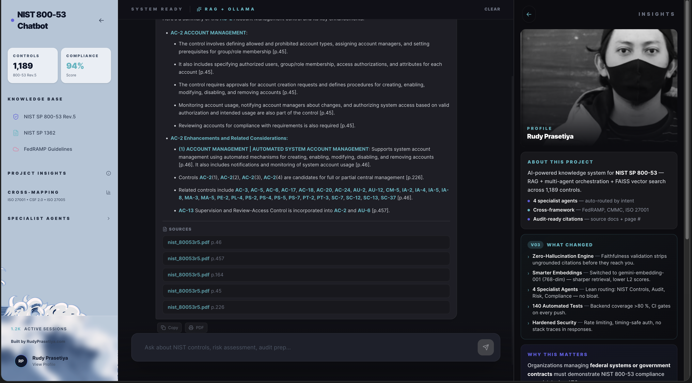
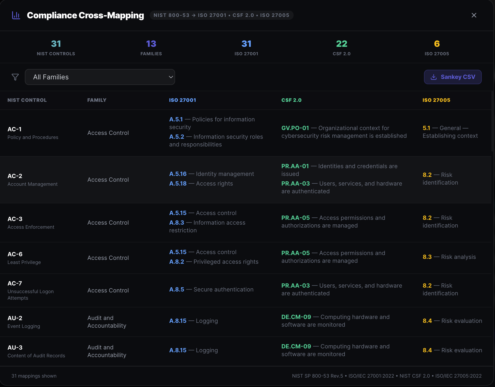

<div align="center">

# NIST 800-53 Intelligence Platform

**Agentic RAG system for federal compliance — 1,189 controls, 7 specialist agents, zero hallucinated citations**

[](https://80053.rudyprasetiya.com)
[](https://python.org)
[](https://react.dev)
[](LICENSE)

</div>

---

## What it looks like

<div align="center">


*Specialist agent answering about AC-2 Account Management with page-level citations from SP 800-53 Rev.5*


*Cross-framework mapping: 31 NIST controls mapped to ISO 27001 · CSF 2.0 · ISO 27005 with Sankey CSV export*

</div>

---

## The Problem

Organizations managing federal systems or government contracts must demonstrate **NIST 800-53 compliance** — or risk losing their ATO. The control catalog is 400+ pages. Knowing *which controls apply*, *how to implement them*, and *what evidence to collect* takes hours of expert research per question.

Most teams either hire expensive consultants or produce compliance artifacts that fail audit scrutiny.

---

## What This Does

An **agentic RAG system** that routes your compliance question to the right specialist agent and answers from actual source documents — with citations to doc name and page number.

```
Your question
     │
     ▼
[Orchestrator] ── keyword routing + LLM fallback ─────────────────────┐
     │                                                                  │
     ├── NIST Controls Specialist    SP 800-53 Rev.5, RMF lifecycle     │
     ├── Audit & Assessment Agent    Evidence, POA&Ms, test procedures  │
     ├── Risk & Impact Agent         FIPS 199, CIA triad, tailoring     │
     ├── Compliance Mapping Agent    FedRAMP, CMMC, ISO 27001, SOC 2    │
     ├── Project Manager Agent       Roadmaps, prioritization           │
     ├── QA Agent                    Test plans, validation             │
     └── DevSecOps Agent             Pipeline security, hardening       │
                                                                        │
     ▼                                                                  │
[RAG Engine] → FAISS (1,540 vectors) → Gemini 2.0 Flash ◄─────────────┘
     │
     ▼
Answer + source document + page number
```

**Cross-framework mapping** — 30 NIST controls mapped to ISO 27001, CSF 2.0, and ISO 27005 with Sankey diagram export.

---

## Why It's Different

| | Typical chatbot | This platform |
|---|---|---|
| Knows *your* documents | ✗ Generic training data | ✓ RAG from your PDFs |
| Right expert per question | ✗ One generic model | ✓ 7 routed specialist agents |
| Cites the source | ✗ Hallucinated references | ✓ Doc + page number |
| Cross-framework aware | ✗ NIST only | ✓ ISO 27001, CSF 2.0, CMMC, ISO 27005 |
| Audit-ready output | ✗ Summaries | ✓ Evidence artifacts, POA&Ms |
| Self-hosted option | ✗ Cloud-only | ✓ Ollama local mode |

---

## Stack

| Layer | Technology |
|-------|-----------|
| **Frontend** | React 19, Vite 7, TypeScript, Tailwind CSS v4 |
| **Backend** | Python 3.12, Flask, LangChain, FAISS |
| **LLM** | Gemini 2.0 Flash (prod) · Ollama/llama3 (local dev) |
| **Embeddings** | `gemini-embedding-001` — 768-dim, L2-filtered retrieval |
| **Retrieval** | MMR search, 2000-token NIST-aware chunking |
| **Infra** | Docker, gunicorn, PostgreSQL, nginx, Let's Encrypt |
| **Security** | Rate limiting, API key auth, CORS lockdown, timing-safe compare |
| **CI** | 140 automated tests — backend coverage >80%, type-checked frontend |

---

## Quick Start

### Prerequisites
- Node.js 18+ & npm
- Python 3.10+
- [Ollama](https://ollama.com) (local dev) **or** Gemini API key (recommended — free at [aistudio.google.com](https://aistudio.google.com/apikey))

```bash
# 1. Clone
git clone https://github.com/asfalanoij/NIST_chatbot
cd NIST_chatbot

# 2. Configure environment
cp .env.example .env
# Edit .env — add GEMINI_API_KEY for best results

# 3. Backend
cd backend
python3 -m venv venv && source venv/bin/activate
pip install -r requirements.txt
python ingest.py          # Build FAISS index from docs/
python app.py             # Starts on :5050

# 4. Frontend (new terminal)
cd frontend
npm install && npm run dev
# Open http://localhost:5173
```

Or with Make:
```bash
make setup && make ingest
make start-backend    # terminal 1
make start-frontend   # terminal 2
```

### Docker (one command)
```bash
cp .env.example .env  # add your GEMINI_API_KEY
docker compose -f docker-compose.prod.yml --env-file .env up -d
# API → http://localhost:5050  |  serve frontend/dist/ with any static host
```

---

## Knowledge Base

Drop PDFs into `docs/` then run `python ingest.py`:

| File | Content |
|------|---------|
| `nist_80053r5.pdf` | SP 800-53 Rev.5 — full control catalog (1,189 controls) |
| `nist_1362.pdf` | NIST SP 1362 — supplemental guidance |
| `fedramp.pdf` | FedRAMP authorization requirements |
| `incidentresponseforwindows.pdf` | IR procedures reference |

Add any compliance PDF — the chunker is NIST-aware and handles control family headers automatically.

---

## API Reference

| Endpoint | Method | Auth | Description |
|----------|--------|------|-------------|
| `/api/health` | GET | — | Status, LLM backend, DB check |
| `/api/chat` | POST | API key | Route question to specialist agent |
| `/api/crossmap` | GET | — | NIST → ISO 27001 / CSF 2.0 / ISO 27005 |
| `/api/crossmap/stats` | GET | — | Coverage statistics |
| `/api/crossmap/sankey` | GET | — | Download Sankey CSV |
| `/api/visitors/count` | GET | — | Visitor statistics |
| `/api/ingest` | POST | API key | Trigger PDF ingestion (disabled in prod) |

**Chat example:**
```bash
curl -X POST https://80053-api.rudyprasetiya.com/api/chat \
  -H "Content-Type: application/json" \
  -H "X-API-Key: <your-key>" \
  -d '{"message": "What evidence do I need for AC-2 assessment?", "history": []}'
```

**Health check:**
```bash
curl https://80053-api.rudyprasetiya.com/api/health
# {"status":"healthy","checks":{"database":"ok","faiss_index":"ok"}}
```

---

## Security Design

- **CORS** locked to configured origins (`CORS_ORIGINS` env var)
- **API key auth** on all write endpoints (`X-API-Key` header, timing-safe comparison)
- **Rate limiting** — 10 req/min chat, 5 req/min ingest
- **Ingestion disabled in prod** — `DISABLE_INGEST=true`
- **No secrets in code** — all config via environment variables
- **Zero stack traces** in API error responses
- Dependencies pinned; CVE monitoring via GitHub Dependabot

---

## Project Structure

```
NIST_chatbot/
├── backend/
│   ├── app.py              # Flask entrypoint, routes
│   ├── orchestrator.py     # Agent routing logic
│   ├── agents/             # 7 specialist agents
│   ├── rag/                # FAISS retrieval, chunking, embeddings
│   ├── crossmap/           # Framework mapping (NIST ↔ ISO/CSF)
│   └── tests/              # 140 pytest tests
├── frontend/
│   ├── src/
│   │   ├── components/     # Chat, CrossMap, Insights panels
│   │   └── hooks/          # API, session, visitor hooks
│   └── dist/               # Production build output
├── docs/                   # Knowledge base PDFs + screenshots
├── nginx/                  # nginx vhost config
├── agenticAI_skills/       # 13-agent dev quality system
└── docker-compose.prod.yml
```

---

## AgenticAI Build System

13 bash agents for development quality assurance:

```bash
./agenticAI_skills/antigravity.sh help              # List all agents
./agenticAI_skills/antigravity.sh qa inspect        # 16-point quality check
./agenticAI_skills/antigravity.sh devsecops scan    # Security scan
./agenticAI_skills/antigravity.sh nist-expert validate  # RAG coverage check
./agenticAI_skills/antigravity.sh pm maturity       # Project maturity score
./agenticAI_skills/antigravity.sh e2e-test run      # Full test suite
```

---

## Testing

```bash
# Backend — 140 tests, >80% coverage
cd backend && source venv/bin/activate
pytest tests/ -v --cov=. --cov-report=term-missing

# Frontend — type check + build
cd frontend
npm run build    # tsc -b && vite build
```

---

## Self-Hosting

The backend and frontend are fully containerized. For VPS deployment with nginx + SSL:

1. Clone to `/opt/nist-chatbot/`
2. Create `.env` with `POSTGRES_PASSWORD`, `GEMINI_API_KEY`, `API_KEY`, `SECRET_KEY`
3. `docker compose -f docker-compose.prod.yml --env-file .env up -d`
4. Point nginx to `127.0.0.1:5050` and serve `frontend/dist/` as static root
5. `certbot --nginx -d your-api-domain -d your-frontend-domain`

---

## About the Author

**Rudy Prasetiya** — IT GRC, Cybersecurity & Internal Audit professional.

This project demonstrates applied AI in compliance engineering: multi-agent orchestration, production-grade RAG, and secure API design — built specifically for the federal compliance domain.

- Website: [rudyprasetiya.com](https://rudyprasetiya.com)
- Live demo: [80053.rudyprasetiya.com](https://80053.rudyprasetiya.com)

---

**License**: MIT
